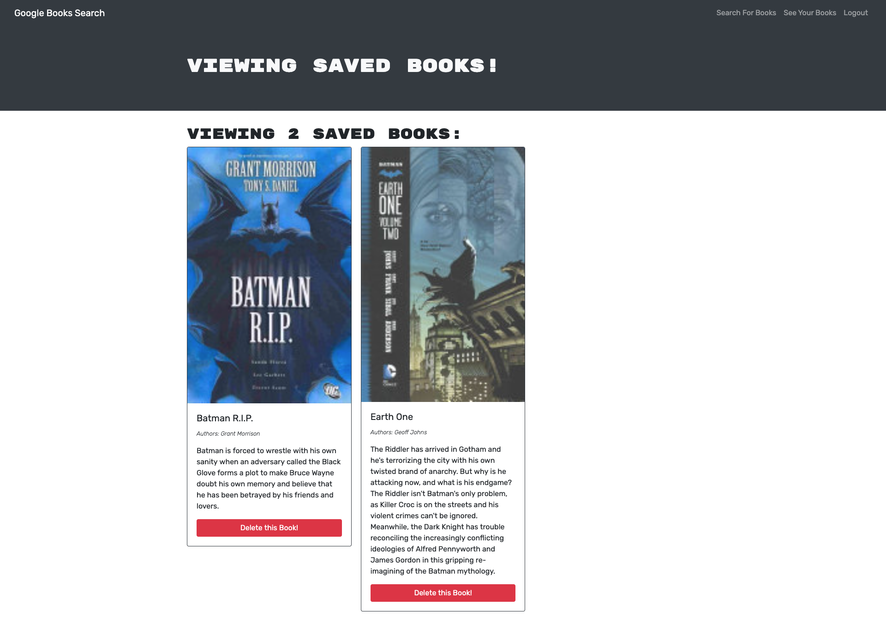

# LookBook

 

  
  
## Table of Contents
  
* [Installation](#Installation)
  
* [Usage](#Usage)
  
* [Contributors](#Contributors)
  
* [License](#License)

* [ScreenShot](*Screenshot)

* [Heroku-App](#Heroku-app)
  
## Installation
  
* None
  
## Usage
  
*  This app allows you to search up books from a google api and save them to your own personal profile.
  

## License
  
*  This project is licensed under the MIT License - see the [License](https://choosealicense.com/licenses/mit/) page.
  

## Screenshot

## Heroku-App

[Deployed-Site](https://pacific-beyond-59842.herokuapp.com/)